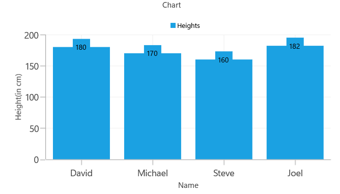

# Getting Started with UWP Charts (SfChart)

This sample demonstrates how to create a UWP Chart using the Syncfusion `SfChart` control.

## Prerequisites

- Visual Studio 2022 or later
- Windows 10 SDK (10.0.17763.0 or later)
- [Syncfusion.SfChart.UWP](https://www.nuget.org/packages/Syncfusion.SfChart.UWP) NuGet package (latest)

## Adding Assembly Reference

### Option 1: Via NuGet Package Manager

1. Right-click on the project in **Solution Explorer** and select **Manage NuGet Packages**.
2. Search for `Syncfusion.SfChart.UWP` and install it.

### Option 2: Via Extension Reference

1. Open the **Add Reference** window from your project.
2. Choose **Windows > Extensions > Syncfusion Controls for UWP XAML**.

## Adding Namespace

After adding the reference, include the following namespace in your `MainPage.xaml`:

```xml
xmlns:syncfusion="using:Syncfusion.UI.Xaml.Charts"
```

## Creating the Data Model

Create a `Person` model class (`Person.cs`) to hold the data:

```csharp
namespace ChartDemo
{
    public class Person   
    {   
        public string Name { get; set; }
        public double Height { get; set; }
    }
}
```

## Creating the ViewModel

Create a `ViewModel` class (`ViewModel.cs`) with sample data:

```csharp
using System.Collections.Generic;

namespace ChartDemo
{
    public class ViewModel  
    {
          public List<Person> Data { get; set; }      

          public ViewModel()       
          {
                Data = new List<Person>()
                {
                    new Person { Name = "David", Height = 180 },
                    new Person { Name = "Michael", Height = 170 },
                    new Person { Name = "Steve", Height = 160 },
                    new Person { Name = "Joel", Height = 182 }
                }; 
           }
     }
}
```

## Initializing the Chart (XAML)

In `MainPage.xaml`, set the `DataContext` to `ViewModel`, then initialize `SfChart` with axes and series:

```xml
<Page
    x:Class="ChartDemo.MainPage"
    xmlns="http://schemas.microsoft.com/winfx/2006/xaml/presentation"
    xmlns:x="http://schemas.microsoft.com/winfx/2006/xaml"
    xmlns:local="using:ChartDemo"
    xmlns:d="http://schemas.microsoft.com/expression/blend/2008"
    xmlns:mc="http://schemas.openxmlformats.org/markup-compatibility/2006"
    xmlns:syncfusion="using:Syncfusion.UI.Xaml.Charts"
    mc:Ignorable="d">

    <Page.DataContext>
        <local:ViewModel/>
    </Page.DataContext>

    <Grid Background="{ThemeResource ApplicationPageBackgroundThemeBrush}">

        <syncfusion:SfChart Header="Chart" Height="300" Width="500">
            <!--Initialize the horizontal axis for SfChart-->
            <syncfusion:SfChart.PrimaryAxis>
                <syncfusion:CategoryAxis Header="Name" FontSize="14"/>
            </syncfusion:SfChart.PrimaryAxis>

            <!--Initialize the vertical axis for SfChart-->
            <syncfusion:SfChart.SecondaryAxis>
                <syncfusion:NumericalAxis Header="Height(in cm)" FontSize="14"/>
            </syncfusion:SfChart.SecondaryAxis>

            <!--Adding Legend to the SfChart-->
            <syncfusion:SfChart.Legend>
                <syncfusion:ChartLegend/>
            </syncfusion:SfChart.Legend>

            <!--Initialize the series for SfChart-->
            <syncfusion:ColumnSeries Label="Heights" ItemsSource="{Binding Data}" XBindingPath="Name" YBindingPath="Height" ShowTooltip="True" >
                <syncfusion:ColumnSeries.AdornmentsInfo>
                    <syncfusion:ChartAdornmentInfo ShowLabel="True" >
                    </syncfusion:ChartAdornmentInfo>
                </syncfusion:ColumnSeries.AdornmentsInfo>
            </syncfusion:ColumnSeries>
                      
        </syncfusion:SfChart>

    </Grid>
</Page>
```

## Initializing the Chart (Code-Behind)

Alternatively, you can create the chart entirely in C# code-behind:

```csharp
using Syncfusion.UI.Xaml.Charts;
using Windows.UI.Xaml.Controls;

public sealed partial class MainPage : Page
{
    public MainPage()
    {
        this.InitializeComponent();
        
        SfChart chart = new SfChart() { Header = "Chart", Height = 300, Width = 500 };

        //Adding horizontal axis to the chart 
        CategoryAxis primaryAxis = new CategoryAxis();
        primaryAxis.Header = "Name";
        primaryAxis.FontSize = 14;
        chart.PrimaryAxis = primaryAxis;

        //Adding vertical axis to the chart 
        NumericalAxis secondaryAxis = new NumericalAxis();
        secondaryAxis.Header = "Height(in cm)";
        secondaryAxis.FontSize = 14;
        chart.SecondaryAxis = secondaryAxis;

        //Adding Legends for the chart
        ChartLegend legend = new ChartLegend();
        chart.Legend = legend;

        //Initializing column series
        ColumnSeries series = new ColumnSeries();
        series.ItemsSource = (new ViewModel()).Data;
        series.XBindingPath = "Name";            
        series.YBindingPath = "Height";
        series.ShowTooltip = true;
        series.Label = "Heights";      

        //Setting adornment to the chart series
        series.AdornmentsInfo = new ChartAdornmentInfo() { ShowLabel = true };

        //Adding Series to the Chart Series Collection
        chart.Series.Add(series);
        this.Content = chart;                  
    }
}
```

## Run the Sample

1. Open `ChartDemo.slnx` in Visual Studio.
2. Build and run the project.
3. The application will display a column chart rendered with the sample data.


## Reference

- [Syncfusion UWP Chart Getting Started Documentation](https://help.syncfusion.com/uwp/charts/overview)
